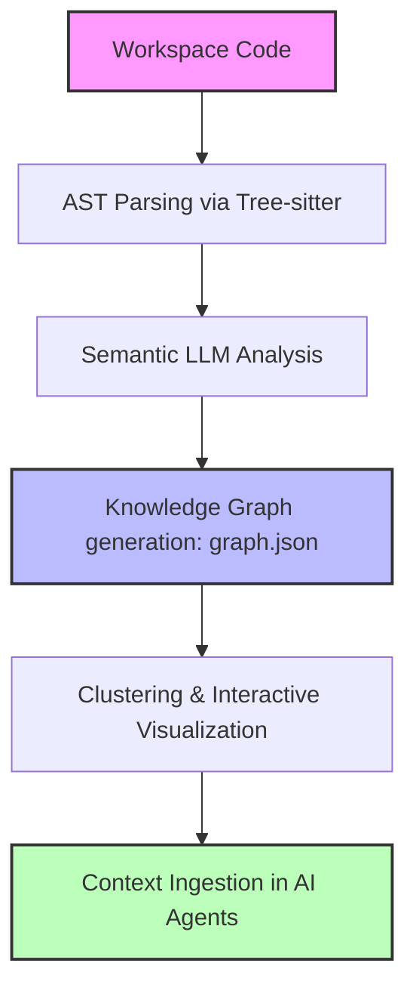

# 📊 Graphify in Your Workspace: Complete Integration & Usage Guide

> [!NOTE]
> **Graphify** is a next-generation codebase indexer that maps your repository into a structured knowledge graph (`graph.json`). It enables AI coding assistants (such as Google Antigravity, Claude Code, Cursor, Aider, and others) to instantly understand your project's architecture, reducing token consumption by up to **70x** by fetching high-precision context instead of reading entire files.

This guide provides step-by-step instructions on initializing Graphify in your workspace and integrating it with various AI coding agents, IDEs, and developer workflows.

---

## 🗺️ How Graphify Works

Graphify parses your codebase, maps symbol dependencies, and groups them semantically to build an interactive representation of your project:



---

## 🚀 Step 1: Initialization & Building the Graph

To index your workspace for the first time and generate the knowledge graph, run the following command in your project root:

```bash
graphify extract .
```

*This command parses your files, builds an Abstract Syntax Tree (AST), performs semantic clustering, and outputs the result into a `graphify-out/` directory containing `graph.json` and interactive HTML visualization files.*

> [!TIP]
> **Watch for changes**: Keep your graph continuously updated as you edit code by running the file watcher in the background:
> ```bash
> graphify watch .
> ```

---

## 🛠️ Step 2: Agent & IDE Integrations

Graphify supports native, automated integrations across popular AI-enhanced IDEs and developer command-line agents. Choose your platform and run the corresponding installation command:

| Platform / IDE / Agent | Installation Command | What happens under the hood? |
| :--- | :--- | :--- |
| **🛸 Google Antigravity** | `graphify antigravity install` | Generates `.agents/rules` + `.agents/workflows` and mounts the custom skill. |
| **🔮 Cursor** | `graphify cursor install` | Generates a systemic rule `.cursor/rules/graphify.mdc` for Cursor Composer/Chat. |
| **💻 VS Code** | `graphify vscode install` | Configures `.github/copilot-instructions.md` for Copilot Chat context steering. |
| **🌐 OpenCode** | `graphify opencode install` | Appends integration to `AGENTS.md` and registers the `tool.execute.before` plugin. |
| **🤖 Aider** | `graphify aider install` | Integrates Graphify rules into `AGENTS.md` for automated ingestion. |
| **🐚 Claude Code (CLI)** | `graphify claude install` | Appends documentation to `CLAUDE.md` and configures a PreToolUse agent hook. |
| **⚙️ Gemini CLI** | `graphify gemini install` | Inserts rules to `GEMINI.md` and provisions a BeforeTool hook. |
| **✈️ Trae / Trae CN** | `graphify trae install` | Appends context steering guidelines to `AGENTS.md`. |

---

## 📖 Deep Dive: Popular AI Agent Configs

### 🛸 1. Google Antigravity
Run the installation command in your root directory:
```bash
graphify antigravity install
```
* **How it works**: The agent is granted direct access to the `graphify` skill, allowing it to programmatically query relationship paths and request concise context snippets about your templates and system behaviors.

### 🔮 2. Cursor (Composer / Chat)
Run the installation command in your root directory:
```bash
graphify cursor install
```
* **How it works**: Cursor will automatically pick up the system instructions from `.cursor/rules/graphify.mdc` during multi-file editing sessions. It prompts Cursor to consult `graphify-out/graph.json` for high-quality architectural context.

### 💻 3. VS Code & Copilot Chat
Run the installation command in your root directory:
```bash
graphify vscode install
```
* **How it works**: VS Code Copilot Chat leverages the directives inside `.github/copilot-instructions.md` to ground its answers using the structural relationships mapped by Graphify.

### 🐚 4. Claude Code (CLI)
Run the installation command in your root directory:
```bash
graphify claude install
```
* **How it works**: Claude Code reads the `CLAUDE.md` file on launch. The configured `PreToolUse` hook intercepts search requests, querying Graphify first to focus the agent's attention on the exact files related to your query.

---

## 🔍 Developer CLI Guide (Interacting with the Graph)

You can interact with your project's knowledge graph directly from your terminal using these handy built-in tools:

### 🌐 1. Interactive Project Tree
Generate an interactive D3-based collapsible tree visualization of your project structure:
```bash
graphify tree --output graphify-out/GRAPH_TREE.html
```
*Open `graphify-out/GRAPH_TREE.html` in your favorite web browser to visually explore class hierarchies, folder nesting, and file clusters.*

### 💬 2. Direct Graph Querying & Exploration
Inspect dependencies, paths, and logic flows via simple terminal queries:

```bash
# Find the shortest relationship path between two functions, classes, or files
graphify path "AuthService" "DatabaseHelper"

# Get a plain-English explanation of a symbol and its adjacent dependencies
graphify explain "WidgetTemplate"

# Query the graph conceptually using breadth-first traversal
graphify query "Where are the workspace templates stored?"
```

---

> [!IMPORTANT]
> **Git Hooks Automation (Recommended)**: 
> To ensure your knowledge graph stays perfectly in sync with your codebase, install the automated Git hooks. This automatically updates `graph.json` after every `git commit` or `git checkout`:
> ```bash
> graphify hook install
> ```
